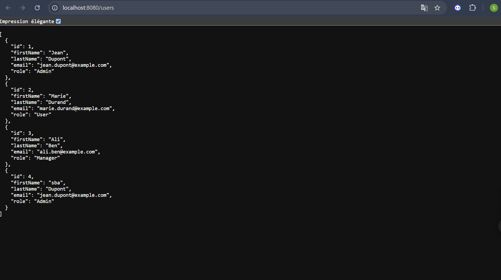

🧩 SOAPDataSpringC — Atelier 5
Ce projet illustre la création de web services REST et SOAP avec Spring Boot, Spring Data REST, et JAX-WS, autour d’une entité simple : User.

🚀 Objectifs du projet
Mettre en œuvre une API REST avec Spring Data REST pour la gestion des utilisateurs.
Créer un service SOAP exposant des opérations CRUD sur les utilisateurs.
Utiliser une base de données H2 en mémoire pour la persistance.
Tester et valider les endpoints avec Postman.

⚙️ Fonctionnalités principales
API REST complète pour l’entité User disponible sur /users.
Service SOAP pour les opérations sur les utilisateurs.
Persistance des données avec la base H2 en mémoire.
Tests possibles via Postman ou directement dans le navigateur.

🗂️ Structure du projet
model/User.java : définit l’entité User (id, firstName, lastName, email, role).
repository/UserRepository.java : expose automatiquement le repository utilisateur via Spring Data REST.
controller/UserController.java : contient des endpoints personnalisés (optionnel).
config/LoadDatabase.java : initialise la base H2 avec quelques utilisateurs par défaut.
SoapDataSpringCApplication.java : classe principale pour le démarrage de l’application.

🏃‍♀️ Démarrage rapide
1️⃣ Cloner le projet
git clone https://github.com/SALMASBA/spring-rest-soap-user-servic
cd spring-rest-soap-user-servic

2️⃣ Lancer l’application
mvn spring-boot:run

3️⃣ Accéder aux endpoints REST
Ouvre ton navigateur ou Postman sur :
http://localhost:8080/users

4️⃣ Tester les opérations
GET /users : liste tous les utilisateurs
POST /users : ajoute un nouvel utilisateur
PUT /users/{id} : met à jour un utilisateur
DELETE /users/{id} : supprime un utilisateur

🧪 Exemples et démonstrations
Structure du projet et logs de démarrage.

Requête POST pour ajouter un utilisateur (dans Postman).

Requête GET pour afficher la liste complète des utilisateurs.

🧰 Technologies utilisées

Java 17+
Spring Boot
Spring Data REST
JAX-WS (SOAP)
H2 Database
Postman
Intégration et test via Postman

## Auteur
- 👩‍💻 Salma SBA
